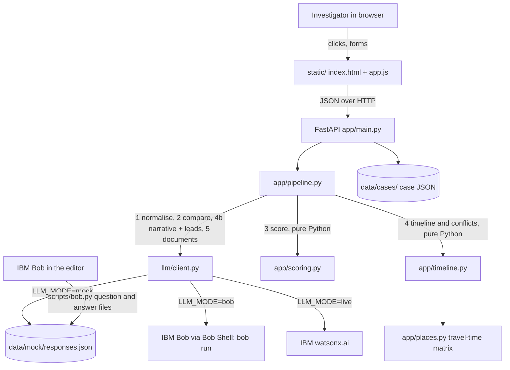

# Architecture

All paths below are relative to `src/`. For how to run it, see
[setup-guide.md](setup-guide.md); for the demo data and scoring numbers, see
[dataset.md](dataset.md).

## System diagram



## Components

| Component | Technology | Responsibility |
|---|---|---|
| Web page | HTML, CSS, plain JavaScript (`static/`) | Forms, timeline, conflict panel, leads, documents |
| API | Python 3.10+, FastAPI, Uvicorn (`app/main.py`) | Endpoints; runs the pipeline; serves the page |
| Pipeline | Pydantic (`app/pipeline.py`) | Calls the AI for language tasks, validates every answer, degrades safely |
| Scoring | Pure Python (`app/scoring.py`) | Description match, credibility, priority; all constants in one `SCORING` dict |
| Timeline | Pure Python (`app/timeline.py`, `app/places.py`) | Main trail, conflict forks, set-aside list |
| AI adapter | httpx, subprocess (`llm/client.py`) | One `complete()` call; mock, IBM Bob (`BobClient`, Bob Shell) or watsonx.ai; disk cache |
| IBM Bob workflow | `scripts/bob.py` | Lets Bob answer the AI questions through files; answers become the offline demo data |
| Storage | JSON files (`data/`) | Seed case, places, saved AI answers, saved cases. No database |

## Security and scalability notes

- Runs on 127.0.0.1 only; no login, no accounts (prototype, one case at a time).
- API keys come from environment variables or `src/.env`, which is git-ignored.
- The demo data is entirely fictional.
- Scaling beyond a demo would need a database, authentication, a routing
  service for travel times, and audit logging.

---

## 1. Architecture

```
 browser (static/index.html + app.js)
        │  fetch JSON
        ▼
 FastAPI (app/main.py) ──── store.py ──── data/cases/<id>.json
        │
        ▼
 pipeline.py ───────────────────────────────────────────────────────────┐
   Stage 1  normalise   (LLM)   raw text      -> Observation[]          │
   Stage 2  compare     (LLM)   Observation   -> field match/mismatch   │
   Stage 3  score       (Python, scoring.py)  -> 3 numbers per sighting │
   Stage 4  timeline    (Python, timeline.py) -> main trail + forks     │
            summarise   (LLM)   narrative + leads, ranked in Python     │
   Stage 5  documents   (LLM)   lead sheet, appeal, case file           │
        │                                                               │
        ▼                                                               │
 llm/client.py  complete(system, user, schema) -> dict  ◄───────────────┘
   ├─ MockClient     data/mock/responses.json  (default, offline)
   └─ WatsonxClient  watsonx.ai chat API, cached in data/llm_cache.json
```

**Where the LLM is used and where it is not.** The model does language
work only: reading messy text, judging whether "dark blue hoodie" matches
"navy sweatshirt", writing prose. Every number (scores, credibility,
priority, lead rank) and every decision about conflicts is plain Python, so
it can be explained and tested.

Stack: Python 3.10+, FastAPI, Uvicorn, Pydantic v2, httpx. No database, no
frontend framework, no build step, no Docker.

---

## 2. Files

| Path | What it does |
|---|---|
| `app/__main__.py` | `python -m app` (run inside `src/`) starts Uvicorn on 127.0.0.1:8000 (`PORT` env overrides) |
| `app/main.py` | All HTTP endpoints; loads the seed case |
| `app/models.py` | Pydantic models: `FamilyIntake`, `Tip`, `CCTVNote`, `Descriptors`, `Observation`, `Case` |
| `app/pipeline.py` | Stages 1, 2, 4 (narrative) and 5; the `ask()` wrapper with retry and degrade |
| `app/scoring.py` | Stage 3. `SCORING` dict holds every weight and rule constant |
| `app/timeline.py` | Stage 4: main trail, forks, set-aside list |
| `app/places.py` | 12 places, travel-time matrix (Floyd-Warshall over hand-written edges) |
| `app/store.py` | Save/load a case as JSON |
| `llm/client.py` | LLM adapter, disk cache, mock client |
| `prompts/*.txt` | The four system prompts (editable without touching code) |
| `static/` | `index.html`, `style.css`, `app.js` |
| `data/seed/case.json` | Demo case: intake, 14 tips, 3 CCTV notes |
| `data/seed/places.json` | Place names, map x/y, aliases, road edges in minutes |
| `data/mock/authored/` | Hand-written "ideal model answers" for the seed case |
| `data/mock/responses.json` | Generated from `authored/` by `scripts/build_mock.py` |
| `scripts/build_mock.py` | Rebuilds the mock cache so keys match what the app asks |
| `smoke_test.py` | End-to-end check through the HTTP API |
| `tests/test_scoring.py` | Hand-computed scoring cases |

---

## 3. Data model

Three raw input types (`FamilyIntake`, `Tip`, `CCTVNote`) are all free text
plus a little metadata (caller name/phone, timestamps, camera).

Each becomes one or more **`Observation`**:

```
id                 "T07-1"  (source ref + sighting number)
source_type        family | tip | cctv
source_ref         "T07"
observed_at        ISO time or null        } a range when the source gives one;
observed_until     ISO time or null        } "before 12" sets only observed_until
location           one of the 12 place names, or null
descriptors        11 fields, each string or null
raw_text           the sentence(s) it came from
extraction_notes   hedges, ambiguities, what was left out
extraction_failed  true if the model failed twice

comparison         field -> {result: match|mismatch|unknown, reason}   (stage 2)
descriptor_score, insufficient, credibility, priority, score_notes    (stage 3)
```

The family intake's observation (`F01-1`) supplies the **baseline**
descriptors and the last-seen time and place.

A **`Case`** holds the raw inputs, all observations, and the derived
`timeline`, `conflicts`, `set_aside`, `leads`, `narrative` and `documents`.
It is saved whole to `data/cases/<id>.json` after every change.

---

## 4. Pipeline

### Stage 1: normalise (`pipeline.normalise_*`, prompt `normalise.txt`)
One LLM call per raw input. The payload carries the text, the relevant
timestamps (so "Saturday" and "tonight" can be resolved), whether the caller
is named, and the list of known places. The model may split one report into
several sightings.

Guards applied in Python after the model answers:
- a time that doesn't parse is dropped, with a note;
- a location not in the list is mapped via aliases or set to null, with a note;
- a total failure produces one observation with `extraction_failed: true`
  ("needs manual entry") instead of an error.

### Stage 2: compare (`pipeline.compare`, prompt `compare_descriptors.txt`)
One call per observation, comparing its 10 scored fields with the baseline.
Guard: if either side of a field is null, the result is forced to `unknown`
regardless of what the model said. (`companions` is extracted but not scored.)

### Stage 3: score (`scoring.score_case`, no LLM)

**Descriptor match (0-100)**

| Field | Weight |
|---|---|
| distinguishing_marks | 25 |
| clothing_upper | 15 |
| clothing_lower | 10 |
| footwear, accessories, hair, height | 8 each |
| apparent_age | 7 |
| build | 6 |
| complexion | 5 |

`score = Σ weight(match) / Σ weight(match or mismatch) × 100`. Unknown fields
leave both sums. Fewer than 3 known fields: capped at 50, `insufficient=True`.

**Credibility (0-100)**
- base: family 90, CCTV 80, named tip 50, anonymous tip 35
- +10 caller left a phone number
- +15 corroborated: another plausible sighting (different source, not
  insufficient) within 120 min at the same or an adjacent place; applied
  once, citing the closest one
- −20 contradicted: physically impossible alongside a sighting with higher
  pre-penalty credibility
- −10 stale: tip received more than 48 h after the sighting

Only sightings with descriptor score ≥ 50 ("plausible") can corroborate or
contradict. The family record takes no part in either.

**Priority** = `0.6 × descriptor + 0.4 × credibility`.

Every adjustment appends a human-readable line to `score_notes`, which the
UI shows.

### Stage 4: timeline (`timeline.build`, no LLM)
1. Set aside (with a reason) anything failed, without a time, without a
   place, or with descriptor score < 50. Nothing is deleted.
2. Sort the rest by credibility (then priority), highest first. Each joins
   the **main trail** unless it is `impossible()` alongside one already there.
3. Each rejected sighting becomes a **fork** against the main-trail sightings
   it clashes with, labelled "Unreconciled — requires field verification".

`impossible(a, b)` = `travel_minutes(a.place, b.place) > gap_minutes(a, b)`,
where the gap between two time ranges is 0 if they overlap.

### Stage 4b: narrative and leads (`pipeline.summarise`, prompt `timeline_narrative.txt`)
One call returns a short narrative and 2-5 leads, each citing observation
ids. Python then:
- drops cited ids that don't exist, and any lead left with no support;
- **ranks** leads by the highest priority among their supporting non-family
  sightings, ties broken by the most recent supporting sighting.

(Leads come from the same call as the narrative to avoid a second call; the
spec did not assign leads to a specific stage.)

### Stage 5: documents (`pipeline.documents`, prompt `generate_documents.txt`)
One call returns `lead_sheet`, `appeal`, `case_file`. The prompt forbids
investigative detail in the appeal and requires "Pending — not stated by
informant" for any unknown case-file field. On failure, each tab shows a
failure message; the rest of the case is unaffected.

---

## 5. LLM layer (`llm/client.py`)

- One interface: `complete(system, user, schema, task) -> dict`.
- `LLM_MODE=mock` (default) → `MockClient`; `LLM_MODE=live` → `WatsonxClient`.
- **Cache key** = `sha256(task + user payload)`. The system-prompt text is
  deliberately left out, so editing wording in `prompts/` doesn't discard a
  known-good cache. Delete `data/llm_cache.json` to force fresh calls.
- `WatsonxClient` checks the cache first, then calls watsonx.ai
  `/ml/v1/text/chat` (IAM token from the API key, temperature 0), parses the
  JSON (tolerating code fences), and caches it.
- `MockClient` serves `data/mock/responses.json`, then the live cache. A miss
  raises `LLMError`, which the pipeline turns into a graceful degrade.
- `pipeline.ask()` validates every response against a Pydantic model. On
  failure it retries once with the error appended; a second failure returns
  `None` and the caller degrades. A bad model response never crashes a request.

Environment variables for live mode:

| Variable | Default |
|---|---|
| `LLM_MODE` | `mock` |
| `WATSONX_APIKEY` | (required for live) |
| `WATSONX_PROJECT_ID` | (required for live) |
| `WATSONX_URL` | `https://us-south.ml.cloud.ibm.com` |
| `WATSONX_MODEL` | `ibm/granite-3-3-8b-instruct` |

---

## 6. API

| Method | Path | Does |
|---|---|---|
| GET | `/api/health` | `{"status": "ok", "llm_mode": ...}` |
| GET | `/api/scoring` | The `SCORING` dict (shown in the UI) |
| GET | `/api/places` | Places and the full travel matrix |
| GET | `/api/case/{id}/seed` | Load the demo case under `{id}` (raw inputs only) |
| GET | `/api/case/{id}` | Full case state |
| POST | `/api/case` | New case from a `FamilyIntake`; runs stage 1 |
| POST | `/api/case/{id}/tip` | Add a tip; runs stages 1-4 (not the narrative) |
| POST | `/api/case/{id}/cctv` | Add a CCTV note; same |
| POST | `/api/case/{id}/analyse` | Process anything new, rescore, rebuild timeline, narrative and leads |
| POST | `/api/case/{id}/documents` | Stage 5 (400 if not analysed yet) |

---

## 7. Frontend (`static/`)

Plain HTML, CSS and JavaScript; no framework, no external CDN, icons are
inline SVG. Styled on the user's templates: portal-style header and tab bar,
service cards, and a form style (grey panel header + badge, uppercase
labels, two-column inputs). Colours are CSS variables at the top of
`style.css`.

- **Tabs** (`tab` variable): home, newcase, addreport, reports, timeline,
  leads, documents, scoring. Each is a `<section data-view>`; `render()`
  shows one and fills its container. Timeline and Leads are disabled until
  analysed; Documents until generated.
- **Home** cards call `seed()`, `analyse()`, `docs()`; each switches to the
  tab that shows the result (Reports, Timeline, Documents).
- **New case** form: the backend takes the family report as one statement, so
  the structured fields are written out as sentences before the free-text
  statement and posted to `POST /api/case`.
- **Rows** expand in place (`open` variable holds the expanded row key). A
  sighting's detail shows the quote, matched/mismatched fields, the priority
  arithmetic and credibility notes.
- **Conflicts** render as a red panel at the top of the Timeline with both
  branches; any report id (`data-go`) jumps to and opens that sighting.
- Verdict words: priority ≥ 80 Strong match, 50-79 Possible, < 50 Weak; the
  unreconciled side of a fork is "Needs checking". A centred overlay shows
  while a request runs. The server sends `Cache-Control: no-cache` so a
  browser never mixes an old `app.js` with a new page.

## 8. Demo data design (`data/seed/`)

Fictional town "Devgadh" on NH-48. Subject: Aarav Rathod, 14, with a scar
above the left eyebrow (the 25-point discriminator).

| Group | Tips | Designed to |
|---|---|---|
| Strong, corroborating | T01, T02, T10, T12 | Form a southward trail; score high |
| Direct conflict | T07 (named, dhaba 11:00-11:30) vs T04 (anonymous, railway 11:30) | 90 min apart: must fork |
| Partial | T06, T09, T14 | Right clothes, wrong or missing age |
| Different person | T05, T08, T11 | Score 0; set aside |
| Vague | T03, T13 | No time: insufficient, set aside |
| CCTV | C01 bus stand, C02 dhaba pump, C03 railway platform | C02 backs the dhaba branch; C03 misses coaches 1-3, so T04 stays open |

Result: one fork (K1: T04 against C02, T07, T12), six set aside, three leads
(truck trace 98, Surat alert 90, railway verification 36).

---

## 9. Testing

```bash
.venv/bin/python smoke_test.py
```
Checks health, the mock client, seeding, the travel matrix, stages 1-2 on
the seed, the fork, the documents (including no investigative detail in the
appeal), the lead ranking, and that an unknown input degrades to "needs
manual entry".

```bash
.venv/bin/python tests/test_scoring.py
```
Three descriptor-score cases (54.3, 50 capped, 0) and three
credibility/priority cases on the seed (T07 → 75/90, T04 → 15/36,
T14 → 65/62.3), each worked out on paper first.

---

## 10. Changing things

- **Edit a prompt:** change `prompts/*.txt`. In mock mode this has no effect
  (answers are canned); in live mode clear `data/llm_cache.json` first.
- **Change a weight or rule:** edit `SCORING` in `app/scoring.py`. The UI
  picks it up automatically. Update the expected numbers in
  `tests/test_scoring.py`.
- **Change the seed case or a payload shape:** edit
  `data/mock/authored/*`, then run `.venv/bin/python scripts/build_mock.py`.
- **Add a place:** add it with its aliases, and its road edges to its
  neighbours, in `data/seed/places.json`.

---

## 11. Decisions and known limitations

- **Python 3.10**, not 3.11 as specced: that is what the machine had. No
  3.11-only features are used.
- **Stale-recall rule** is applied as "received more than 48 h after the
  sighting". The spec's literal wording reverses this and could never fire.
- **One road link was shortened** (bus stand to Lake Garden, 18 → 12 min)
  because range-based times exposed a false conflict with consistent tips.
- **Scores treat missing details as neutral**, as specced. So a tip with 3
  matching fields can score 100, the same as one with 6. The UI shows "not
  mentioned: N of 10" to make the difference visible.
- **Travel times are hand-coded** for 12 places (`TODO` in `places.py`); a
  real system needs a routing service.
- **Mock answers are hand-written** to the same no-fabrication rules as the
  prompts. The live client has not yet been run against watsonx; its first
  real test is running the seed case live and comparing with `authored/`.
- **Not built** (out of scope per spec): login, real maps, face recognition,
  image upload, SMS/email, multi-case dashboard, database, PDF export.

---

## 12. Using IBM Bob as the AI (`scripts/bob.py`)

Bob runs inside the editor rather than behind an API, so questions and
answers go through files. `BobClient` stands in for the LLM client: for each
call it looks for `bob/answers/<name>.json`; if missing, it writes the full
question (system prompt + exact input) to `bob/questions/<name>.md` and the
call is treated as pending (no retry question is generated for it).

Rounds, because later inputs depend on earlier answers:
1. 18 `normalise` questions
2. 17 `compare_descriptors` questions (need the extracted sightings)
3. 1 `timeline_narrative` question (needs every sighting scored)
4. 1 `generate_documents` question (needs the leads)

When nothing is pending, the answers are written to `data/mock/responses.json`
under the app's cache keys, so the demo runs offline on Bob's output.
File names are `<task>__<id>__<first 6 chars of the cache key>`. If an answer
fails validation, the pipeline's normal retry produces a new question with
the error appended, for Bob to correct. `python scripts/build_mock.py`
restores the hand-written answers.
